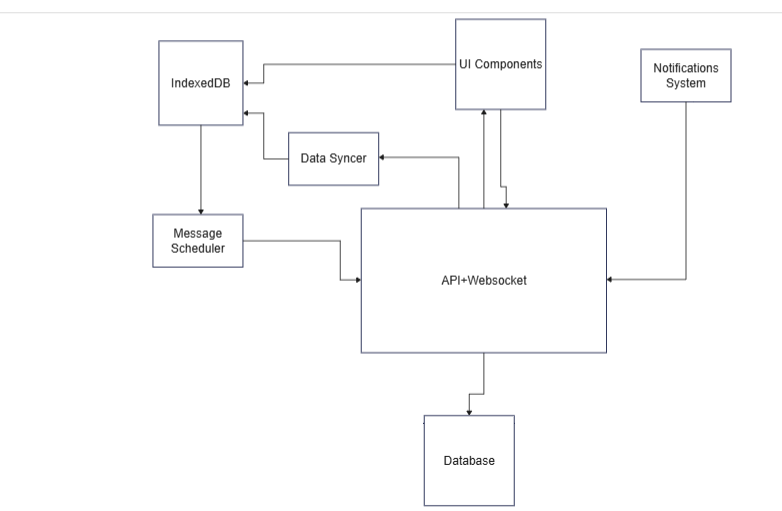
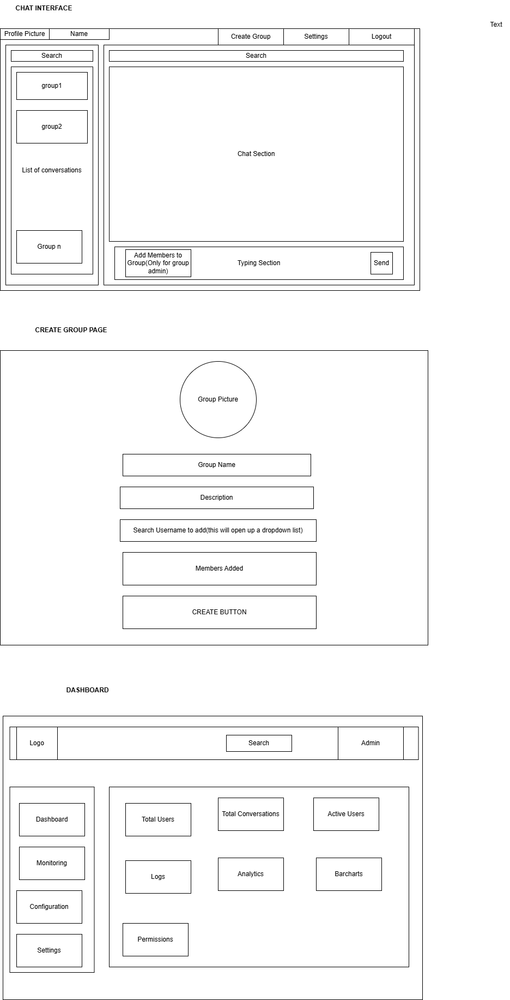
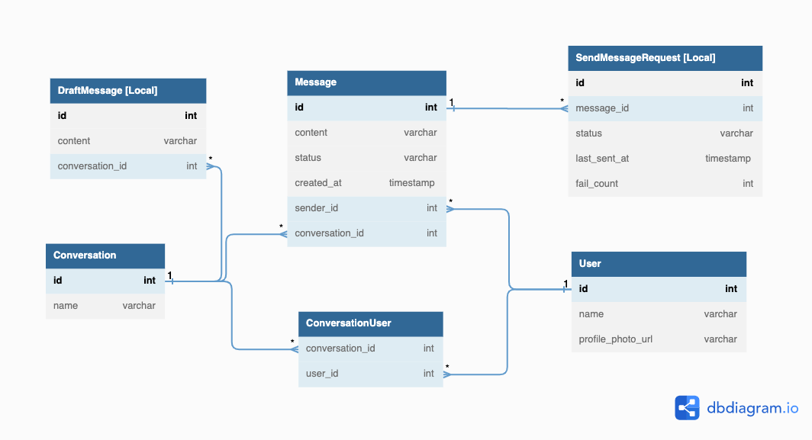
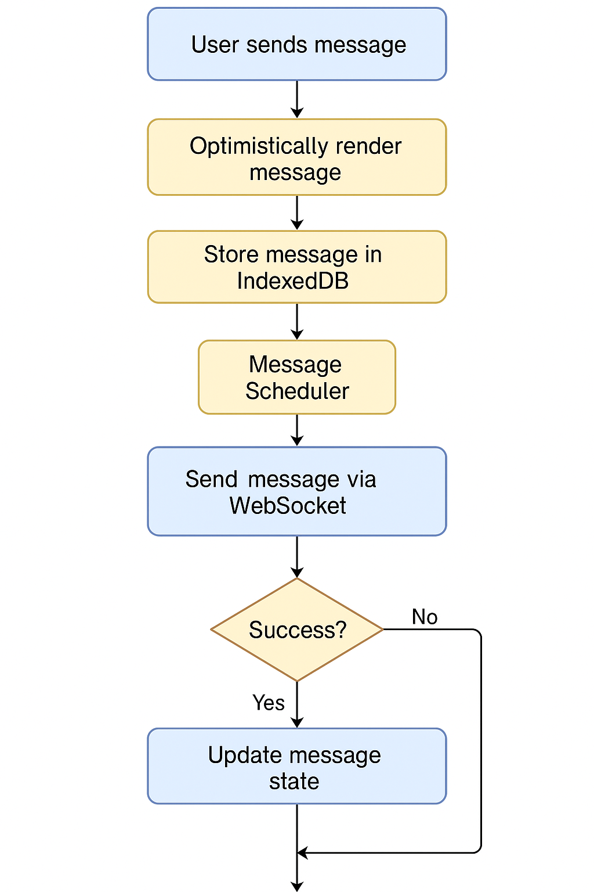

**Group Chat App-Design Document**

This manual offers a thorough system design for a stable frontend for an enterprise-class Group Chat desktop application. Real-time communication, network APIs, offline-first data storage, user experience patterns, progressive enhancement, and operational best practices are all covered. The objective is to use diagrams and current best practices to describe every facet of the architecture.

**Architecture**



**UI Designs**



**Components Architecture**

```
<App>
  <Header>
    <ProfileMenu />
    <NavigationBar />
    <CreateGroupPage />
  </Header>
  <AdminDashboard/>
  <MainLayout>
    <Sidebar>
      <SearchBar />
      <ConversationList>
        <ConversationItem />
      </ConversationList>
      <CreateGroupButton />
    </Sidebar>
    <ChatWindow>
      <ChatHeader />
      <MessageList>
        <MessageItem />
      </MessageList>
      <AddMembersButton />
      <MessageInputArea>
        <TypingBox />
        <SendButton />
      </MessageInputArea>
    </ChatWindow>
  </MainLayout>
  <Routes />
</App>

<CreateGroupPage>
  <GroupPictureUploader />
  <GroupNameInput />
  <GroupDescriptionInput />
  <MemberSearchDropdown />
  <SelectedMembersList />
  <CreateGroupButton />
</CreateGroupPage>

<AdminDashboard>
  <AdminHeader />
  <AdminSidebar>
    <Dashboard />
    <Monitoring />
    <Configuration />
    <Settings />
  </AdminSidebar>
  <AdminMainPanel>
    <StatsCards />
    <Logs />
    <AnalyticsCharts />
    <PermissionsManager />
  </AdminMainPanel>
</AdminDashboard>
```

**IndexedDB Data Storage and Access Patterns**

IndexedDB is used by the app for client-side storage of messages, conversations, and pertinent data. Low-level browser database API IndexedDB can keep key-value object stores filled with large volumes of structured data—including files/blobs. Indexed Database is asynchronous, non-blocking, supports transactions and indices for effective querying unlike simpler storage (e.g. LocalStorage).
IndexedDB is accessed by the program via Dexie library. Usually, access is wrapped in asynchronous functions under Promises or async/await.
Multiple object stores in a well-structured IndexedDB design help to arrange data by type.For usual access patterns, every store makes use of suitable key paths and indexes.



**Message Scheduler**

Especially in cases of an app outage or network problems, a Message Scheduler component manages departing messages. Its duties comprise message states (sent, pending, failed), retrying with exponential backoff, and queuing messages for later delivery. This guarantees a flawless user interface whereby messages created offline are not lost but delivered once connectivity is restored.
Its aim is:

1. Message queue departing from here
2. Retrying exponential backoff
3. Batches several messages.
4. retry and order guarantee.
5. Background sync integration
6. Handling failure



**Data Synchronization between Local and Server**

The application requires a Data Syncer mechanism in addition to sending outbound messages in order to maintain consistency between the server state and the local IndexedDB data. Reconciling any offline changes after going back online entails retrieving fresh data (such as messages and conversation updates) from the server.
Its objective:

1. Pays attention to websocket push events
2. Pull updates when the tab is refocused or the app reconnects.
3. Resolves conflicts (e.g., if another device has already delivered a sent message).
4. Modifies the in-memory state and the indexed database

**Real-Time Communication via WebSockets**

We will be using websockets for real time communications.We will be using it for instant message delivery, typing indicators, and presence updates in the chat app.

**REST APIs**

We will be using rest apis for the following flows:-

1. Authentication apis
2. User Information apis
3. Conversations related apis
4. Notifications settings
5. Admin Flows

**Authentication and Authorization Workflows**

1. **User Login:**
   • User Action: The user enters their username and password into the login form.
   • Client Request: The client sends a POST request to the server's login endpoint with the provided credentials.
   • Server Response: Upon successful verification, the server responds with:
   o An Access Token (short-lived, e.g., 15 minutes)
   o A Refresh Token (long-lived, e.g., 7 days)
2. **Token Storage:**
   • Access Token: Stored in memory (e.g., a JavaScript variable) to minimize exposure to cross-site scripting (XSS) attacks.
   • Refresh Token: Stored in an HTTP-only, secure cookie to prevent access via JavaScript, enhancing security.
3. **Accessing Protected Resources:**
   • Client Request: For each API call requiring authentication, the client includes the Access Token in the Authorization header:
   Authorization: Bearer <access_token>
   • Server Validation: The server validates the Access Token:
   o If valid, the server processes the request and returns the appropriate response.
   o If invalid or expired, the server responds with a 401 Unauthorized status.
4. **Token Refresh Flow:**
   • Client Action: Upon receiving a 401 Unauthorized response, the client sends a POST request to the token refresh endpoint, including the Refresh Token stored in the HTTP-only cookie.
   • Server Response: If the Refresh Token is valid and not expired, the server issues a new Access Token.
   • Client Update: The client replaces the old Access Token with the new one in memory.
5. **Logout Process:**
   • Client Action: When the user logs out, the client:
   o Clears the Access Token from memory.
   o Deletes the Refresh Token cookie.
   • Server Action: Optionally, the client notifies the server to invalidate the Refresh Token, ensuring it cannot be used again.

**Role-Based Access Control (Authorization)**
Frontend Authorization (for UX only)
• The client reads the role from the JWT or from a separate rest api endpoint.
• Based on the role:
o An Admin sees extra UI features: "Admin Panel", "Delete any message", "User management".
o A Moderator might see a "Mute user" option.
o A User sees only their own conversations.

**Offline Support and Full PWA Functionality**

• Service Worker caches static assets (HTML, CSS, JS) during install.
• cache-first strategy to ensure instant loading, even when offline.
• For API responses (e.g., messages, conversations), use a network-first strategy with fallback to cache.
• Prefer IndexedDB for storing structured data like messages and conversations.
• Cache then Network strategy for non-critical content (e.g., avatar images).
• Allow offline UI behaviour.
• Queue outgoing messages using message scheduler.
• window.addEventListener('online') and 'offline' to track connectivity.
• On going online:Hide offline UI,Trigger Message Scheduler to flush queued messages,Trigger Data Syncer to fetch missed updates.
• Background Sync API to retry sending queued messages.
• Push Notifications to notify users of new messages even when the app isn’t open.
• On push click: open app, load message from IDB or fetch it.
• Provide manifest.json with app name, icons, and theme.
• Installable as a desktop app via Chrome/Edge.
• Use skipWaiting() + clients.claim() or next-load update strategies.
• Show “New version available” banner if needed.
• hashed filenames for JS/CSS to avoid stale caches.
• Update cache.addAll() in service worker with new hashed file names per release.
Summary Layered Strategy
• Service Worker: caches app shell for offline load.
• IndexedDB: stores message/conversation data for offline use.
• Background Sync: ensures queued messages are sent when back online.
• UI Feedback: keeps user informed about offline capabilities and limitations.
• Manifest + Push + Install: enables full PWA experience with engagement features.

**Notification System (In-App & Push Notifications)**

In-App Notifications
In-app notifications are alerts presented within the application interface when the user is actively engaged with the app.
Key Features:
• Real-Time Alerts: Display toast messages or banners for new messages or mentions.
• Visual Indicators: Update badges or highlight conversations with unread messages.
• Sound Notifications: Play subtle sounds to draw attention to new activity.
• Focus Detection: Adjust notification behavior based on whether the app window is in focus.
User Action -> Backend Server ->WebSocket Connection -> Client App-> Display In-App Notification

Push Notifications
Push notifications are system-level alerts sent to the user's device, even when the app is not active or the browser is closed.
Key Features:
• Subscription Management: Users subscribe to notifications via the browser's Push API.
• Service Worker Integration: A service worker listens for incoming push events.
• Notification Display: Upon receiving a push event, the service worker displays a notification with relevant details.
• User Interaction Handling: Clicking the notification can open or focus the app and navigate to the pertinent conversation
Backend Server ->Push Service ->Browser Push Manager -> Service Worker ->Display System Notification

**Presence and Status Indication System**

The presence system makes sure that user status is visible:
• High fidelity in real time through websocket events (instantaneous updates on online/offline/typing).
• In restrictive networks, revert to periodic polling to preserve basic status information.
• The user interface (UI) uses online status indicators (green dots, "Last seen..." messages) to contextualize conversations (e.g., knowing if the other person is likely to respond quickly).
• Eventually, consistency in the presence data is crucial (the server is the source of truth). Receiving a "user offline" but then a message from that user (implying that they weren't offline) is an example of a situation that the front-end should handle. This is probably done by trusting message events (if someone sends a message, they're obviously online, so update status accordingly).

**Optimistic UI Updates and User Experience**

Optimistic UI is a design pattern where the interface updates immediately in response to user actions, assuming success, and only later rectifies any errors. This greatly improves perceived performance and reactivity in the chat app. We will be applying optimistic updates in several places.

**Scroll Position Management**

We will employ:
• Careful scroll position retention when adding content, so users don’t lose context.
• Automatic scrolling for new messages when appropriate (when user is at bottom).
• Virtualized list rendering to handle large histories without slowdowns, using libraries that support stable prepends and scroll anchor maintenance.

**Accessibility (ARIA, Keyboard Navigation, A11y Best Practices)**
We will be focusing on the following to improve accessibility.

1. Semantic HTML
2. ARIA roles
3. Keyboard navigation
4. Focus indication
5. Testing with screen readers.
6. ARIA Practices
7. Accessible forms

**Logging, Monitoring, and Observability**
We will be incorporating comprehensive logging and observability to track errors, performance, and user behavior in the app for continuous improvement and quick troubleshooting.Tools and techniques that we will be using are below.

1. Error tracking using sentry
2. Real User Monitoring(RUM)
3. Performance Profiling in Production
4. Availability Monitoring
5. We track Web Vitals as mentioned and possibly some Quality of Service metrics

**Internationalization (i18n) and Localization (l10n) Strategies**

We will be using the google translate widget for text translation in the app.

**Feature Flags and A/B Testing**

To enable controlled rollouts and experimentation, we employ a feature flag system in the frontend. Feature flags (also known as feature toggles) allow new features to be turned on or off at runtime without code deployments.They also enable A/B testing by gradually exposing features to subsets of users and measuring impact

**Testing Strategy (Unit, E2E Testing)**

For Unit testing we will be using React Testing Library.
For E2E testing we will be using playwright.
Test Automation and CI: All tests (unit and a subset of E2E) run in continuous integration on each commit or PR.

**Performance Optimizations**

We will employ the following techniques to improve performance.

1. Caching
2. Batching Network Requests
3. Debounce/Throttle User Actions
4. Lazy Loading and Code Splitting
5. Minification and Compression
6. List Virtualization
7. Batch DOM Updates on Window Blur/Focus

**Admin Dashboard and Management Features**
The Admin Dashboard provides control and oversight capabilities:
• User & conversation management (CRUD, roles, moderation),
• System monitoring (stats, logs possibly),
• Configuration (feature toggles, limits, etc. at org/system level).
We design it to be consistent with the rest of the app, secure (only visible to authorized roles), and efficient for potentially large data sets (with search, filters, paging to help manage scale).

**Error Handling and Edge Case Management**

**Network Errors & Offline Handling**
• Use navigator.onLine and window.offline to detect offline state.
• Show banner: “You appear to be offline.”
• Queue actions like message sends.
• Block/disallow loading new data (e.g., conversations) with message: “Cannot load data while offline.”
• Service worker can return fallback or cached data when network fails.

---

**Retry & Backoff**
• Use exponential backoff for retrying WebSocket/API reconnects.
• Provide a "Retry" button for failed requests (e.g., messages not loading).

---

**API Error Handling**
• 401 Unauthorized: Trigger token refresh; if fails, redirect to login.
• 403 Forbidden: Show “You don’t have permission for this action.”
• 404 Not Found: Redirect and show “This conversation is no longer available.”
• 500 Server Error: Show friendly message, suggest retry, log to Sentry.
• 409 Conflict: Show “Edit failed due to conflict,” optionally reload data.

---

**Client-Side & Runtime Errors**
• Use React Error Boundaries to catch UI errors.
• Display: “Oops, something went wrong. Please try reloading.”
• Log details to monitoring tools like Sentry.

---

**Graceful Degradation**
• No IndexedDB: Fall back to in-memory, warn about offline limitations.
• No Service Worker: App still runs; offline mode disabled.
• No WebSocket: Fallback to polling with notice of reduced performance.

---

**Conversation-Level Edge Cases**
• Empty Conversations: Show “No messages yet. Say hello!”
• Large Message: Warn or prevent if size exceeds limit.
• Failed Attachments: Show “Upload failed.” with retry option.
• Unresolved Mentions: Don’t break UI; show plain text.
• Typing Indicator: Auto-clear after timeout (e.g., 10s).

---

**Multiple Tabs / Devices**
• Use localStorage events or BroadcastChannel to sync read states.
• Reflect actions (e.g., mark as read) across tabs.

---

**Memory/Resource Edge Cases**
• Cap queued messages if user spams “Send” offline.
• Avoid storing too many messages in memory.
• Use IndexedDB as source of truth to fetch older data.

---

**User-Friendly Error Messaging**
• Avoid raw codes like “Error 500”.
• Show messages like:
o “Message not sent. Try again?”
o “Reconnecting... Retrying in X seconds.”
o “Storage full. Cannot save more messages offline.”

---

**Edge Case Testing**
• Simulate slow network, partial data loads, IDB quota issues, push/SW registration failures.
• Ensure app doesn’t crash and displays useful fallbacks.

---

**Error Logging & Observability**
• Log significant errors (not just validation failures).
• Useful for tracking frequency, cause, and impact of issues.
