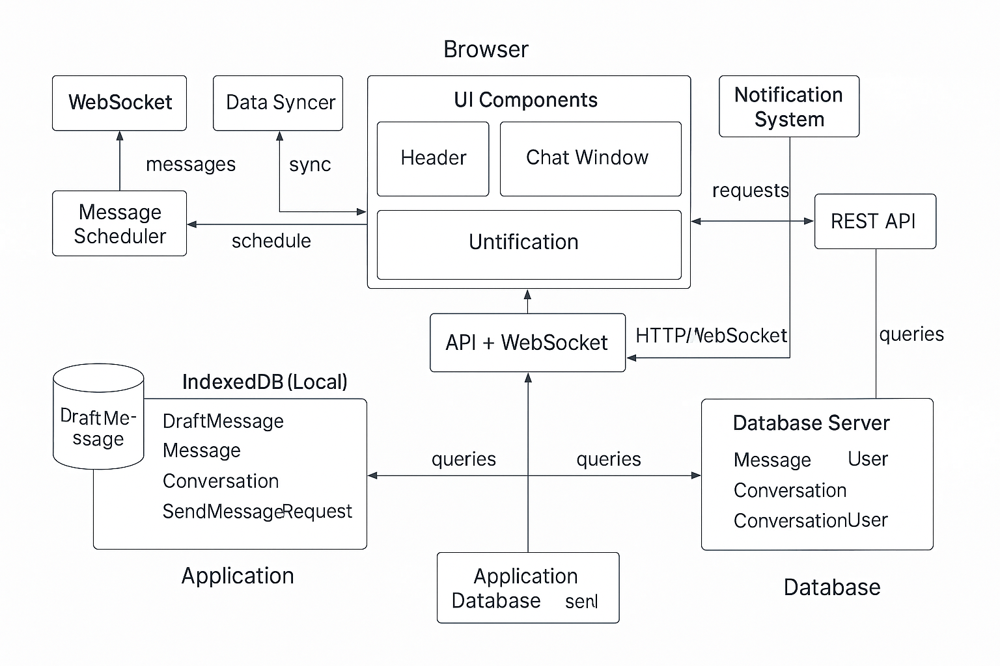

Enterprise Group Chat App – Frontend System Design Guide

Overview: This guide provides a comprehensive, technical system design for a robust Enterprise-grade Group Chat Desktop App frontend. It covers offline-first data storage, real-time communication, network APIs, user experience patterns, progressive enhancement, and operational best practices. The goal is to detail each aspect of the architecture with updated best practices, including diagrams.

Architecture

\*In the diagram it is wrongly mentioned as untification,actually its unification(means having a single design system for enhancing component reusability).

IndexedDB Data Storage and Access Patterns
Role of IndexedDB: The app uses IndexedDB for client-side storage of messages, conversations, and related data. IndexedDB is a low-level browser database API that can store significant amounts of structured data (including files/blobs) in key-value object stores. Unlike simpler storage (e.g. LocalStorage), IndexedDB is asynchronous, non-blocking, and supports transactions and indices for efficient querying.
Database Schema: A well-structured IndexedDB design uses multiple object stores to organize data by type.Each store uses appropriate key paths and indexes for typical access patterns.

Access Patterns: The app accesses IndexedDB via a well-tested library (such as Dexie or idb) or the native API. Access is typically wrapped in asynchronous functions using Promises or async/await.

Performance Considerations: IndexedDB reads/writes are asynchronous and generally fast, but bulk operations (like loading thousands of messages) should be done carefully. Use cursors or pagination for extremely long conversations to avoid locking the main thread. Also, creating appropriate indexes is important for performance; retrieving by indexed fields is much faster than filtering in application code. Keep the number of indexes reasonable (each index incurs storage and maintenance overhead on writes). Finally, consider using binary data (ArrayBuffers) for large payloads (like images) or store references to blobs in IndexedDB if needed, leveraging IndexedDB’s ability to store file objects.

Message Scheduler – Offline Queueing and Retries
A Message Scheduler component handles outgoing messages, especially when the app is offline or experiencing network issues. Its responsibilities include queuing messages for later delivery, retrying with exponential backoff, and managing message states (sent, pending, failed). This ensures a seamless user experience where messages composed offline are not lost but delivered once connectivity is restored.

Queuing Outgoing Messages: When a user sends a message, the app first adds it to the UI optimistically and stores it in the Outbox (e.g. IndexedDB store for pending messages) with a status like pending. Instead of immediately erroring out due to no connection, the message is safely persisted locally. The Outbox entry might include the message content, temporary ID, conversationId, timestamp, and a retry count.

Exponential Backoff for Retries: A retry mechanism is used to prevent overwhelming the server or draining client battery if connectivity is poor. Exponential backoff means each retry waits longer than the previous – for example, 1 second, then 2s, 4s, 8s, etc., up to a max interval (e.g. a minute). This strategy avoids constant retry loops when the server is down or network is offline, and prevents flooding the server with reconnection attempts. The scheduler can implement this via setTimeout or via service worker background sync events. Each attempt will try to resend all pending messages in the Outbox.

By queueing messages offline and using a backoff retry strategy with background sync, the app guarantees eventual delivery once connectivity is restored, without draining resources or duplicating messages during network flaps.

Data Synchronization between Local and Server
Apart from sending outbound messages, the app needs a Data Syncer mechanism to keep the local IndexedDB data consistent with the server state. This involves pulling new data (e.g. messages, conversation updates) from the server and reconciling any offline changes once back online.

Initial Sync on Load: When the app (or user session) starts, the client should fetch the latest state from the server to prime the local cache. This typically includes: the list of conversations the user is part of, recent messages or at least conversation-level info (last message, unread counts), and any relevant user or presence info. The client might call a bulk endpoint (e.g. GET /api/conversations?includeLastMessage=1) to get conversation metadata and last messages in one go. These are then stored in IndexedDB (Conversations store and Messages store). Subsequent detail (full message history) can be lazy-loaded when the user opens a conversation.
Real-time Updates: While connected (via WebSocket, see below), new messages will stream in and can be immediately applied to IndexedDB and UI. However, if the app goes offline or is closed, some messages might be missed in real-time. Therefore, on returning online, the client must sync the gaps. One strategy is to track, for each conversation, the timestamp or ID of the last message received. The Data Syncer can then request any messages since that last ID when connectivity returns or the app is reopened. For example, after a period offline, the client might call GET /api/conversations/{id}/messages?since={lastReceivedTimestamp} for each active conversation to retrieve missed messages. The server should return any messages (or events like edits/deletes) that occurred while the client was offline. These are then merged into IndexedDB (ensuring no duplicates – the message IDs can serve as unique keys).
Failure Recovery: If a sync operation fails (due to network issues or server unavailability), the app should retry (perhaps integrated with the Message Scheduler’s backoff logic or simply try again when the user actively navigates). The user can also manually trigger a refresh (e.g., pull-to-refresh in the conversation view to fetch latest messages explicitly). Providing a manual refresh gives power users a way to resolve inconsistencies if automatic sync lags behind.
By combining real-time updates and periodic or on-demand synchronization, the system ensures eventual consistency: the local cache will converge with server state, even after network interruptions or app closures. The local-first design (using IndexedDB) allows the app to be highly responsive (reading from local DB) while the syncer ensures that the local data doesn’t drift from source of truth on the server.

Real-Time Communication via WebSockets
Real-time messaging is powered by a persistent WebSocket connection to the server. WebSockets enable low-latency, bidirectional communication – essential for instant message delivery, typing indicators, and presence updates in a chat app.

Connection Management: On app startup (after authentication), the frontend establishes a WebSocket connection (e.g. wss://chat.example.com/realtime). If using a library like Socket.IO or SignalR, this may be abstracted.
The connection URL or protocol includes an auth token or uses a WebSocket sub-protocol for authentication. This token is the same JWT or session that the REST API uses, ensuring the WS connection is authorized.
Subscription & Routing: The server will typically push events for any conversation the user is a member of. Depending on backend, the client might need to subscribe to specific channels/rooms after connecting (e.g., send a message like { action: "subscribe", conversations: [id1, id2, ...] }). In other systems, the server knows the user’s rooms and will automatically send relevant messages. In either case, the client’s onmessage handler needs to distinguish event types – e.g., new message events, user typing events, presence changes, etc., based on an eventType field or separate WS channels.

Handling Incoming Messages: When a new message event is received over WebSocket, the client should immediately:
• Update the Messages store in IndexedDB (add the new message if not already present)
• Update the conversation’s last message and unread count (if the user is not currently viewing that conversation)
• Update the UI: if the relevant conversation is open, append the message to the message list (and possibly auto-scroll, see Scroll Management). If the conversation is not open, increment the unread badge for that conversation in the sidebar and potentially fire a notification.
All these should happen quickly to preserve the real-time feel. Since WebSocket events can arrive frequently, especially in busy group chats, ensure updates are efficient (batch DOM changes where possible, e.g. using requestAnimationFrame or virtualized list updates).

Reconnection Strategy: WebSocket connections can drop due to network issues or server restarts. The client implements a robust reconnect strategy with exponential backoff to re-establish the connection when lost. On onclose or onerror, it should attempt reconnect after a delay (e.g. start with 1 second, then 2, 4, ... up to perhaps 30s). The delay timer can reset once a connection stays open successfully for some time. This backoff prevents overload if the server is down – without it, dozens of clients could continuously hammer the server trying to reconnect simultaneously.

During reconnect attempts, the UI can indicate “Reconnecting...” status to the user. Once reconnected, a resync is advisable: the client should fetch any messages that were possibly missed while disconnected (as described in Data Syncer) since some messages might have been sent while the connection was offline.

Failover and Fallback: In enterprise settings, it’s important to maintain functionality even if WebSocket fails (e.g., due to a corporate proxy blocking WS). A possible fallback is to use long-polling or Server-Sent Events (SSE) if a WS connection cannot be established. Libraries like Socket.IO automatically fall back to HTTP long-polling if WebSockets are unavailable. Long-polling involves the client making an HTTP request that the server holds open until an event is available, then the client immediately re-requests after receiving data. While less efficient than WS, it ensures the app still receives messages. This should be treated as a fallback only, as it’s less scalable due to overhead. In long-poll mode, the Message Scheduler and Data Syncer need to operate similarly (the server would respond with new messages in each poll response).

Scaling Considerations: One WebSocket connection per user is the norm. The server side likely employs a pub/sub system to route messages to all connected clients in a conversation. The frontend doesn’t need full knowledge of that, but should be aware that messages may arrive slightly out-of-order in rare cases (if multiple server nodes, etc.) and handle accordingly (e.g. trust server timestamps for ordering). Also, if the app is open in multiple windows/devices for the same user, each might have its own WS connection. This can lead to duplicate message events; the client could de-duplicate by message ID or ignore events for messages it already has.

In summary, WebSockets provide the realtime backbone: instant delivery of chat messages and status updates. With intelligent reconnection and fallback strategies, the chat remains reliable and responsive under varying network conditions.

REST API Structure, Endpoints, and Payloads
While WebSockets handle live updates, RESTful APIs (or GraphQL, depending on implementation) provide the means for initial data fetch, user actions that don’t fit WebSockets, and as a fallback communication channel. A clear REST API design is critical for the frontend to retrieve and manipulate data.

REST API Design Principles: The API follows REST principles with logical resource URLs and standard HTTP methods. Endpoints are versioned (e.g. under /api/v1/...) to allow evolution. The API uses JSON for request and response bodies. Common resources for a chat system include users, conversations, messages, etc.

All endpoints should use proper HTTP status codes (e.g., 200/201 for success, 400 for validation errors, 401 for unauthorized, 409 for conflict, etc.). The request and response schemas should be well-documented and versioned. For instance, the message object might evolve to include reactions or thread replies; versioning the API or fields helps maintain compatibility.

Payload Examples: Consider the Unread count update. If the user reads messages, the client might call POST /api/conversations/{id}/read?upto={messageId} to mark messages up to a certain ID as read. The server records that and maybe responds with new unread count = 0. This could also be handled via WebSocket events but having a REST endpoint ensures it can be done via a simple call if needed.

Another example is search (if supported): GET /api/search?query=keyword could return matching messages or conversations, which the frontend uses to display results (could also be scoped like GET /api/conversations/{id}/search?query=...).

Best Practices: The frontend should be mindful of network efficiency:
• Use bulk endpoints to reduce round trips (e.g., one call to get all conversation info rather than one per conversation).
• Employ HTTP caching where appropriate. For relatively static resources (like user profile images or large channel history that rarely changes), use ETags and cache headers. This way, repeated requests will result in 304 Not Modified if data unchanged, saving bandwidth.
• Use pagination for long lists (conversations, messages) to avoid over-fetching. The UI can lazy-load additional pages when the user scrolls up in history (infinite scroll pattern).
• Secure all endpoints with TLS (HTTPS) and require auth tokens – no calls should succeed without proper authorization headers or cookies (except maybe login). Fail gracefully in the UI on 401 (trigger re-login or token refresh flow).

By designing a clean, RESTful API and using it alongside WebSockets, the app benefits from both robust data fetching (bulk and on-demand via REST) and instant updates (via WS). The frontend should handle combining these – e.g., initial data via REST, live updates via WS, using consistent data models for both sources.

Authentication and Authorization Workflows
Robust authentication (authN) and authorization (authZ) are crucial for an enterprise chat app, ensuring only legitimate users access data and actions are permission-checked.

Authentication Flow: Typically, the app will integrate with enterprise SSO or use a secure username/password login:
• In a standalone scenario, the user is presented with a login form (or an SSO redirect). On submission, the frontend calls POST /api/auth/login with credentials or an OAuth authorization code. The server responds with an authentication token (often a JWT) and possibly a refresh token. The token might be a JWT containing user info and expiry, or a session ID referencing server session state.
• The client then stores this token securely and includes it on subsequent requests (e.g. in the Authorization: Bearer <token> header for REST API calls, or as a cookie if using cookie-based auth). For WebSocket, the token is included in the connection handshake (query param or a custom headers if the WS protocol allows).
• SSO Considerations: In enterprise environments, OAuth2/OpenID Connect is common. The app might redirect to an IdP (Identity Provider) login page or open a popup for SSO. After authentication, it receives a token (via redirect URI or message) to use for API calls. The frontend must handle token storage and renewal in these flows as well.
Token Storage & Security: An important best practice is to avoid storing JWTs or tokens in plain local storage due to XSS risks. Instead, tokens can be kept in memory or in HTTP-only cookies. If using cookies for auth, they should have HttpOnly, Secure, SameSite flags to mitigate XSS/CSRF. If using JWT in memory, on refresh or new browser session the user will need to log in again (or use a refresh token flow). Many modern apps use a refresh token that is stored in a HttpOnly cookie (more secure) and a short-lived access token in memory. The refresh token endpoint can provide a new access token when the old expires.

Auth0’s security guidance, for example, recommends in-memory storage for sensitive tokens in SPAs to reduce persistence in the browser. In our app, we might:
• Store the JWT access token in a variable (or Redux store state) and not persist it to local storage.
• If a persistent login is needed, use a refresh token stored as an HttpOnly cookie (since cookies are not accessible to JS, they are safer from XSS). The refresh token can be long-lived but is only sent to the auth server, not to the API for other calls.
Using Tokens: Each REST API request includes the token: e.g., an Authorization: Bearer <jwt> header, which the server validates. For WebSocket, if using raw WS, the client can send a connection init message containing the token as soon as the socket opens (or use a protocol like JSON Web Token in the Sec-WebSocket-Protocol header if supported). Failing to authenticate should cause the server to close the connection; the client then should re-auth or log out.

Token Refresh: The frontend should handle token expiration gracefully. If a JWT is about to expire (say in 5 minutes), the app can proactively call refresh. Alternatively, on any API 401 Unauthorized response, the app can attempt to refresh the token (if a refresh token is present). Only if refresh fails (or not available) should it redirect to login. This ensures a seamless experience without sudden logouts when tokens expire.

Logout: A logout action should clear any stored tokens (memory or storage) and if needed inform the server (like hitting a logout endpoint to invalidate refresh tokens or sessions). Also disconnect the WebSocket on logout. In an enterprise scenario, logout might also redirect the user to a global logout page (if using SSO, possibly to fully log them out from the IdP as well).

Authorization (Access Control): Not all users have equal permissions. The app must enforce some access control on the frontend (primarily for UI/UX purposes) and rely on the server for enforcement (for security):
• Roles: The app may have roles like User, Moderator, Administrator. These could be encoded in the JWT (e.g., a role claim) or fetched from an API (/api/users/me could return roles/permissions).
• Front-end behavior: Based on role/permissions, the UI can conditionally show or hide certain features. For example, an “Admin” might see an Admin Dashboard section (user management, etc.) that regular users do not. A moderator might have a “Delete Message” button visible for any message, whereas a regular user only sees that button on their own messages. Feature flags (discussed later) could also control some of this.
• Backend enforcement: The server always enforces permissions on critical actions (the frontend checks are just for convenience). For instance, even if a malicious user enables a hidden "delete message" button via dev tools, the DELETE /api/messages/{id} endpoint would check if that user has rights (owner of message or admin) and return 403 Forbidden if not.
Session Management: In some enterprise contexts, multiple concurrent sessions might be limited (for security/compliance). The app should handle a scenario where the server invalidates the token (e.g., user logged in elsewhere or admin revoked access). In such cases, API calls may start failing with 401, and the WebSocket might close with an auth error. The frontend should catch these and prompt the user to log in again.

MFA and Advanced Auth: If multi-factor authentication is required, the workflow might involve additional steps (like an OTP code). The frontend should accommodate these by perhaps displaying an OTP input when the API indicates MFA is needed. This is highly application-specific but worth mentioning for completeness.

Auditing & Logging: As part of auth, any critical change (like password change or new device login) might be logged or trigger notifications. While mostly backend responsibility, the frontend should display messages like “Your password was changed” or “New login from Chrome on Windows” if the API provides that info.

In summary, the authentication workflow ensures each user is securely identified (via tokens/SSO) and the authorization model ensures users only see and do what they’re permitted. The front-end follows best practices by securing token storage, handling token refresh, and reflecting permission differences in the UI while relying on the backend for true enforcement.

Offline Support and Full PWA Functionality
Supporting full offline usage is a cornerstone of this design. Users should be able to open the app, read past messages, and even compose messages while offline. This is achieved via Service Workers, caching strategies, and IndexedDB, effectively making the app a Progressive Web App (PWA) that can operate without network connectivity.

App Shell Caching: The service worker will cache the essential application shell files (HTML, CSS, JS, icons) so that the app loads reliably offline. Using a cache-first strategy for these static assets ensures instant loads on subsequent visits.
In summary, the offline strategy is multi-layered:

1. Service Worker caching of the app shell ensures the app loads and is functional offline.
2. IndexedDB persistence of data enables reading and writing chats offline.
3. Background sync and careful event handling ensure those offline writes sync up later.
4. User cues (offline indicators) and thoughtful UI states ensure the user knows what they can/can’t do offline.
5. The app meets PWA criteria, allowing installation and improved engagement (e.g., re-engaging users via push, and providing a native-like experience).

Notification System (In-App & Push Notifications)
Effective notifications keep users informed of new messages or mentions, even when they are not actively looking at that conversation or the app. Our system includes both in-app notifications (visual or sound alerts within the UI) and push notifications (system notifications delivered via the browser or OS).

Presence and Status Indication System
A presence system shows which users are online, away, or offline in real-time – an important social feature in chat apps. It also covers ephemeral states like “user X is typing…”. We implement presence primarily via WebSocket for immediacy, with fallbacks for when real-time fails.

Optimistic UI Updates and User Experience
Optimistic UI is a design pattern where the interface updates immediately in response to user actions, assuming success, and only later rectifies any errors. This greatly improves perceived performance and reactivity in the chat app. We apply optimistic updates in several places, most notably when sending messages.

Scroll Position Management
Chat interfaces involve potentially long message lists that need to scroll smoothly and handle dynamic content. Two key challenges are maintaining scroll position when content changes and efficiently rendering very long lists (virtualization).

Scroll Position Maintenance: In a chat, new messages typically append at the bottom. The expected behavior is:
• If the user is already scrolled to the bottom (reading latest messages), a new incoming message should auto-scroll the list down to show it (stick-to-bottom behavior).
• If the user has scrolled up (viewing older messages), new messages should not yank the scroll; instead, an indicator like “⬇ 3 new messages” can appear, and the user scrolls down manually when ready.
• When the user loads older messages (prepend to top of list), the scroll position should stay at the same message after loading. Without special handling, if you prepend a bunch of DOM elements, the browser would push the content down and the user’s scroll position would jump.

Accessibility (ARIA, Keyboard Navigation, A11y Best Practices)
Ensuring the chat application is accessible (a11y) is essential for an enterprise product, as it will be used by people with diverse abilities and needs. We incorporate accessibility from the ground up: proper semantics, ARIA roles for the chat interface, full keyboard support, and other best practices.

Progressive Web App Service Worker Strategies
Expanding on the PWA aspects, the Service Worker (SW) is a key component enabling offline and background capabilities beyond basic caching.

The service worker elevates the app to an installable, resilient application:
• It caches and serves content offline,
• syncs data in the background for reliability.
• receives push notifications and user interactions with them,
• and generally acts as a proxy between the app and network, giving us control to implement the strategies that make the user experience smooth and robust even with flaky connectivity.

Logging, Monitoring, and Observability
In an enterprise environment, monitoring the front-end is as important as the back-end. We incorporate comprehensive logging and observability to track errors, performance, and user behavior in the app for continuous improvement and quick troubleshooting.
By implementing these observability measures, we ensure we have actionable insights into the app’s behavior and performance in the wild. If an error occurs, we can pinpoint it with minimal user input. If performance is suffering for some users, we have data to investigate. This is crucial for maintaining enterprise-level SLAs and user satisfaction.

Internationalization (i18n) and Localization (l10n) Strategies
Our chat app is built with global usage in mind. Internationalization (i18n) is the engineering process of designing the app to support multiple languages and locales, and Localization (l10n) is the actual translating and adapting to specific locales. We implement robust i18n from the start
We bake in internationalization support by externalizing all text, using i18n frameworks for pluralization and formatting, and designing flexible UI for different languages. This prepares the app to be localized to any locale with minimal code changes, just by supplying new translation files and tweaking CSS for RTL when needed.

Feature Flags and A/B Testing
To enable controlled rollouts and experimentation, we employ a feature flag system in the frontend. Feature flags (also known as feature toggles) allow new features to be turned on or off at runtime without code deployments. They also enable A/B testing by gradually exposing features to subsets of users and measuring impact
Testing Strategy (Unit, Integration, E2E Testing)
A comprehensive testing strategy is vital to maintain quality. We employ multiple levels of testing – Unit tests, and End-to-End (E2E) tests – often visualized as a testing pyramid.

Performance: Caching, Batching, and Optimization Techniques
To provide a smooth user experience, we incorporate various performance optimizations on the frontend. Some we've already touched on (caching, virtualization). Here we summarize and add additional strategies focusing on efficiency:

HTTP Response Caching: We use HTTP caching headers on APIs where appropriate. For instance:
• The GET /api/conversations list might have an ETag and the server can return 304 Not Modified if nothing changed since last fetch. The service worker or browser can utilize this to avoid re-downloading same data. In practice, because we often update conversations, this is less useful, but for things like a static list of emojis or company directory, ETag caching is valuable.
• We might cache static lookup data (like list of emoji, or list of frequently @mentioned names) in IndexedDB or memory.
In-Memory Caching: Within the app runtime, we avoid redundant calculations and fetches:
• If the user switches between conversations and back, we don’t refetch messages from server if we have them in IDB. We retrieve from IDB (fast) and only fetch new messages that arrived since last view.
• We can keep an in-memory cache (like a simple JS Map or use React Query library for caching API calls) for short-term caching. For example, user profiles could be cached in memory to avoid re-requesting the same user info repeatedly for multiple messages. Also, presence status might be cached for a short time unless an update event arrives.
Batching Network Requests: To reduce HTTP overhead, we batch requests when possible. For example:
• Instead of sending 10 separate REST calls to mark 10 conversations as read, send one call with all IDs in payload (if API supports, e.g., POST /api/conversations/read with list of convIds).
• If using GraphQL, it naturally allows fetching multiple resources in one round-trip. We aren’t explicitly using GraphQL here, but it’s worth noting such approaches. Some frameworks or libraries allow automatic batching of close-in-time requests.
• If the app has periodic updates via REST (like polling presence or sync), ensure those are combined rather than separate per item. Perhaps a single /api/sync endpoint returns all needed updates (new messages, presence changes) in one go if WS is unavailable.
Debounce/Throttle User Actions: For inputs like search, or typing indicators, we debounce them to avoid flooding. E.g., don’t send a typing event for every keystroke; send at most one per second. This reduces load dramatically without losing user experience quality. Similarly, if the user resizes window causing many re-renders, throttle some heavy operations (though modern React handles most fine).

WebSocket Message Batching: If our client needs to send many WebSocket messages quickly (not common in chat, except maybe typing and presence pings), we could batch them. Or if using a library, it may buffer a few and send together. But since WS is low overhead per message, it’s usually fine.

Lazy Loading and Code Splitting: The app is large (with many features like admin panel, etc.), so we break the JS bundle into chunks that load on demand. For example, the Admin Dashboard code should load only when an admin actually navigates to that section. Using dynamic import() for that route ensures regular users don’t pay the cost for code they never use. Similarly, maybe the emoji picker widget can be a separate chunk loaded when user clicks the emoji button, as it might include heavy data (all emojis, images).
• This reduces initial load bundle size, improving first load time and FID.
Minification and Compression: We ensure production build is minified and tree-shaken (remove unused code). Also enable Gzip/Brotli compression on static files from server so download is faster.

WebAssembly if Applicable: Unlikely needed here, but if we had a heavy computation (like text encryption for end-to-end encryption, or very heavy image processing), we might offload to WebAssembly or a Web Worker to keep the UI thread responsive.

Using Web Workers: For any heavy tasks that could block the main thread (for example, indexing a large conversation for search, or encrypting/decrypting messages), use a Web Worker. The worker can interact with IndexedDB as well (with some limitations). For instance, if an admin feature exports chat history to a file, the serialization and formatting could be done in a worker to avoid freezing the UI.

Memory Management: In a long-running app, especially if user opens for days, make sure to release references to large data when not needed. For example, if we load messages for a conversation and then user switches to another, we can drop the large array of the previous conversation from memory (relying on IDB if needed again). Also using virtualization helps not accumulating all DOM nodes. Observing memory usage and perhaps implementing some cache eviction (like only keep last N conversations’ messages in memory, others only in IDB).

Fast DOM Operations: Use efficient update patterns:
• Bulk DOM changes in a single update (like adding a batch of messages using a document fragment or letting the virtualized list handle it) rather than one-by-one causing layout thrash.
• Avoid forced synchronous layouts – e.g., reading and writing DOM properties interleaved can cause reflows. Where needed, measure all needed sizes first, then apply all changes.
• Leverage CSS for animations instead of JS (like for new message fade-in, use CSS transition on opacity to avoid JS heavy lifting).
Monitoring and Profiling: Use the logging we set up to catch performance outliers. E.g., if we see in RUM that one user had a 5-second pause when sending a message, investigate (maybe their device was low-end or a specific browser issue). We also test on a variety of devices (simulate slow devices via devtools) to ensure our virtualization and such still hold up.

Resource Batching: When loading images (like user avatars), use a CDN and consider using  on images so that off-screen avatars (in long member lists) don’t all load at once.

Caching API Data in IndexedDB: We often write data to IndexedDB for offline. We can also use it to cache network responses even beyond offline. For example, the first time we load a conversation’s messages, save them. Next time (even if online), we could quickly show cached messages while fetching newer ones from network (similar to stale-while-revalidate). This hybrid approach can give near-instant UI updates with eventual sync. Workbox offers networkFirst with cached response fallback which aligns to this idea.

Batch DOM Updates on Window Blur/Focus: If the app is in background (not visible), it may still get many messages via WS. We could accumulate them and update UI in batches when the user focuses the window, instead of doing individual updates while hidden (which could waste resources). Or at least reduce priority of rendering when tab is hidden (some frameworks do that by default, and browsers throttle background tabs to some extent). But ensuring minimal work in background helps battery life.

Admin Panel Performance: If admin dashboard lists thousands of users or messages, apply similar strategies: pagination, virtualization, search filtering on server-side to not overload the client.

By applying these performance optimization techniques, we ensure the app remains snappy and efficient under load. Caching and batching reduce unnecessary network and rendering work. Virtualization and workers handle large data gracefully. The result is a responsive experience even as data scales, which is critical for enterprise usage.
Admin Dashboard and Management Features
For enterprise deployments, an Admin Dashboard is often needed, allowing privileged users (IT admins, team managers) to monitor and manage the chat environment. While the admin interface could be a separate app, we consider it part of our frontend (perhaps hidden behind an admin role and loaded on demand).
Error Handling and Edge Case Management
Robust error handling distinguishes a polished app. We plan for and gracefully handle various error scenarios and edge cases, providing feedback to users and ensuring the app remains stable.
